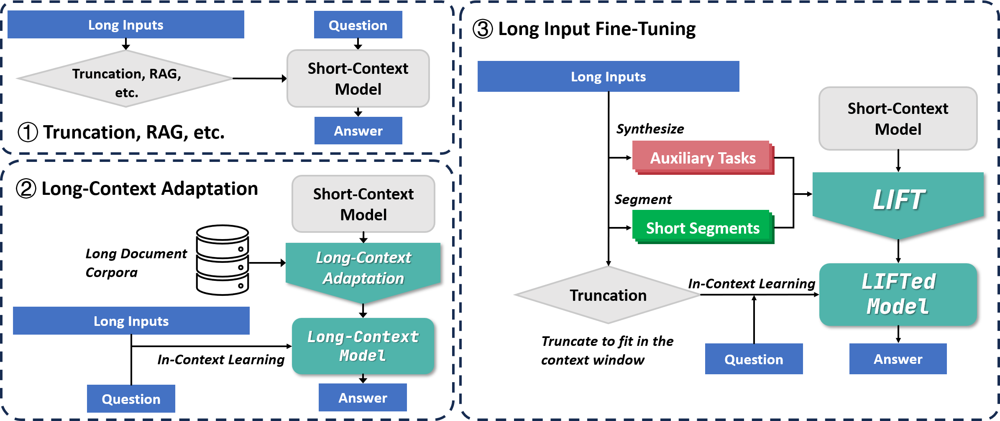
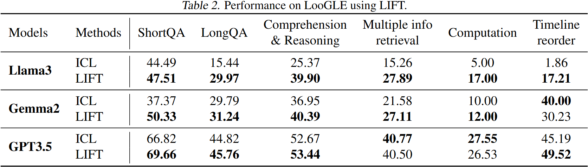
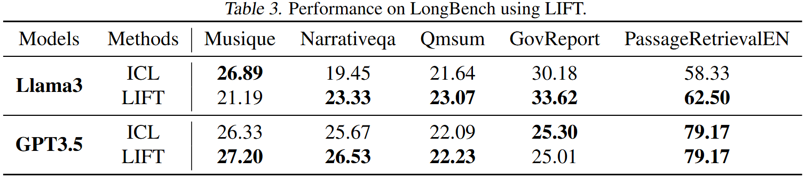

# LIFT: Improving Long Context Understanding of Large Language Models through Long Input Fine-Tuning

## Abstract

Long context understanding remains challenging for large language models due to their limited context windows. This paper presents Long Input Fine-Tuning (LIFT), a novel framework for long-context modeling that can improve the long-context performance of arbitrary (short-context) LLMs by dynamically adapting model parameters based on the long input. Importantly, LIFT, rather than endlessly extending the context window size to accommodate increasingly longer inputs in context, chooses to store and absorb the long input in parameter. By fine-tuning the long input into model parameters, LIFT allows short-context LLMs to answer questions even when the required information is not provided in the context during inference. Furthermore, to enhance LIFT performance while maintaining the original in-context learning (ICL) capabilities, we introduce Gated Memory, a specialized attention adapter that automatically balances long input memorization and ICL. We provide a comprehensive analysis of the strengths and limitations of LIFT on long context understanding, offering valuable directions for future research.



## Quick start: apply LIFT to your models

We recommend **using LIFT with LoRA** first, before exploring our Gated Memory adapter, since our implementation of Gated Memory is based on Llama and applying LoRA is much more easier.

### Install the environment

1. Create conda environment (recommend) with Python 3.10:
    ```shell
    conda create -n lift python=3.10
    conda activate lift
    ```
2. Install Pytorch 2.5.1 (following the instruction in [Pytorch](https://pytorch.org/get-started/previous-versions/)).
3. Install LIFT as a local package (Make sure you are running the shell command in the `LIFT/` working directory.):
    ```
    pip install .
    ```
    If you need to modify the code, we recommend installing `lift` in editable mode:
    ```shell
    pip install -e .
    ```

### Apply LIFT to your models

We provide functions `load_model` and `load_tokenizer` to help you load the model and the tokenizer. You can also use API provided by huggingface to load your model and tokenizer.

```python
from lift.model import load_model, load_tokenizer

model = load_model(
    'Meta-Llama-3-8B-Instruct',  # it can be a local path
    use_lora=True,
    lora_rank=128,
    load_in_4bit=True,
)
tokenizer = load_tokenizer('Meta-Llama-3-8B-Instruct')
```

We provide a default `ContextDataset` to help you construct a training dataset from a context. Notice that `ContextDataset` implements the simplest setting in our paper (3.1), not containing auxiliary tasks nor contextualized training.

```python
from lift.context_dataset import ContextDataset

context = "..."  # e.g. a long article
dataset = ContextDataset(context, tokenizer)
```

Then you can train your model with LIFT. We use `transformers.Trainer` to train the LLM, so you should provide a huggingface `TrainingArguments`.

```python
from lift.train import train
from transformers import TrainingArguments

# The following hyper-parameters are set according to our experiments.
training_args = TrainingArguments(
    learning_rate=2e-4,
    adam_beta1=0.9,
    adam_beta2=0.98,
    adam_epsilon=1e-8,
    max_grad_norm=1.0,
    num_train_epochs=8,
    output_dir='temp_model',  # this arg is not used in our program but it must be provided when trianing with Trainer
    overwrite_output_dir=True,
    per_device_train_batch_size=1,
    logging_strategy='steps',
    logging_steps=1,
    save_strategy='no',
    bf16=True,
    tf32=False,
    gradient_checkpointing=True
)
model = train(
    model,
    dataset,
    tokenizer,
    training_args,
)[0]
model.eval()
```

At last you can use the LIFTed model to do inference on downstream tasks.

```python
import torch

mixin = tokenizer("...", add_special_tokens=False)['input_ids']
input_text = "..."  # The context together with the prompt
model_max_length = 7800

input_ids = tokenizer(input_text, add_special_tokens=False)['input_ids']
if len(input_ids) > model_max_length:
    input_ids = input_ids[:model_max_length//2 - len(mixin)] + mixin + input_ids[-model_max_length//2:]
input_ids = torch.tensor(input_ids, dtype=torch.long, device=model.device).unsqueeze(0)
attention_mask = torch.ones_like(input_ids)
output = model.generate(
    input_ids=input_ids,
    attention_mask=attention_mask,
    pad_token_id=tokenizer.pad_token_id,
    max_new_tokens=200,
    use_cache=True,
    do_sample=False,
)
response = tokenizer.decode(output[0][input_ids.shape[-1]:], skip_special_tokens=True)
```

## Reproduce the results

We provide the scripts we used to evaluate LIFT in `shells`, which are detailed as following.

### Main results



| Model   | Method | Subtask | Script path                                |
|:-------:|:------:|:-------:|:------------------------------------------:|
| Llama 3 | ICL    | ShortQA | `shells/LooGLE_main/Llama-ICL-ShortQA.sh`  |
| Llama 3 | ICL    | LongQA  | `shells/LooGLE_main/Llama-ICL-LongQA.sh`   |
| Llama 3 | LIFT   | ShortQA | `shells/LooGLE_main/Llama-LIFT-ShortQA.sh` |
| Llama 3 | LIFT   | LongQA  | `shells/LooGLE_main/Llama-LIFT-LongQA.sh`  |
| Gemma 2 | ICL    | ShortQA | `shells/LooGLE_main/Gemma-ICL-ShortQA.sh`  |
| Gemma 2 | ICL    | LongQA  | `shells/LooGLE_main/Gemma-ICL-LongQA.sh`   |
| Gemma 2 | LIFT   | ShortQA | `shells/LooGLE_main/Gemma-LIFT-ShortQA.sh` |
| Gemma 2 | LIFT   | LongQA  | `shells/LooGLE_main/Gemma-LIFT-LongQA.sh`  |



| Model   | Method | Subtask            | Script path                                                |
|:-------:|:------:|:------------------:|:----------------------------------------------------------:|
| Llama 3 | ICL    | GovReport          | `shells/LongBench_main/Llama-ICL-gov_report.sh`            |
| Llama 3 | ICL    | Musique            | `shells/LongBench_main/Llama-ICL-musique.sh`               |
| Llama 3 | ICL    | Narrativeqa        | `shells/LongBench_main/Llama-ICL-narrativeqa.sh`           |
| Llama 3 | ICL    | PassageRetrievalEN | `shells/LongBench_main/Llama-ICL-passage_retrieval_en.sh`  |
| Llama 3 | ICL    | Qmsum              | `shells/LongBench_main/Llama-ICL-qmsum.sh`                 |
| Llama 3 | LIFT   | GovReport          | `shells/LongBench_main/Llama-LIFT-gov_report.sh`           |
| Llama 3 | LIFT   | Musique            | `shells/LongBench_main/Llama-LIFT-musique.sh`              |
| Llama 3 | LIFT   | Narrativeqa        | `shells/LongBench_main/Llama-LIFT-narrativeqa.sh`          |
| Llama 3 | LIFT   | PassageRetrievalEN | `shells/LongBench_main/Llama-LIFT-passage_retrieval_en.sh` |
| Llama 3 | LIFT   | Qmsum              | `shells/LongBench_main/Llama-LIFT-qmsum.sh`                |
